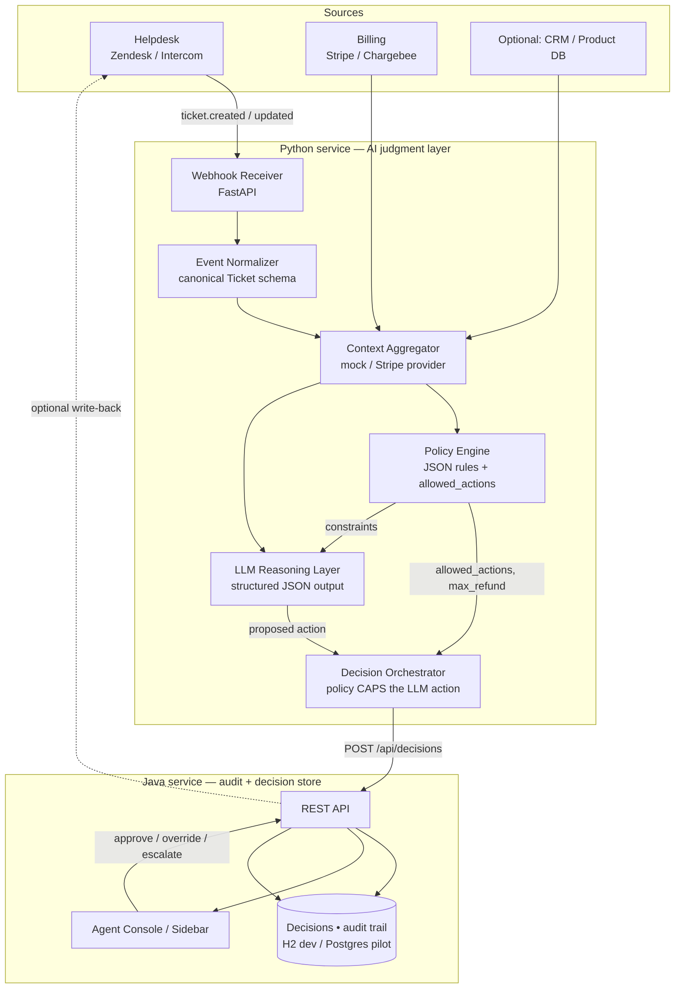

# Technical Architecture

The whole product rests on one principle:

```
Hard rules (policy)  →  Soft reasoning (LLM)  →  Human decision  →  Audit
```

**Never let the LLM invent an action outside what policy allows.** That is the trust
story and the legal cover. In this codebase that boundary is enforced in code by the
**Decision Orchestrator** (`python-service/app/orchestrator.py`), not just by a prompt.

---

## 1. System diagram



Why the split? Python is where the AI "wow moment" and the LLM ecosystem live. Java is
the durable, traceable system of record that ops and finance buyers trust — a full
record of *what was recommended, what the human did, and why*.

---

## 2. Request flow (single ticket)

```mermaid
sequenceDiagram
    participant Z as Zendesk / Intercom
    participant W as Webhook (FastAPI)
    participant C as Context Provider
    participant P as Policy Engine
    participant L as LLM Reasoner
    participant O as Orchestrator
    participant A as Audit Store (Java)
    participant U as Agent Console

    Z->>W: ticket.created webhook
    W->>W: normalize -> Ticket
    W->>C: fetch customer + billing context
    C-->>W: CustomerContext snapshot
    W->>P: build_facts(ticket, context) -> evaluate
    P-->>O: decisive_action, allowed_actions[], max_refund_usd, flags
    W->>L: ticket + context + policy (incl. allowed_actions)
    L-->>O: proposed action, amount, confidence, reason
    O->>O: ENFORCE — clamp action to allowed_actions; cap refund
    O->>A: POST /api/decisions (pending)
    A-->>O: stored decision id
    O-->>W: Decision (returned to caller)
    U->>A: agent approves / overrides / escalates (+reason)
    A->>A: append immutable audit action
    A-.->>Z: optional tag / internal note
```

---

## 3. The pipeline, stage by stage

| # | Stage | Code | What it does |
|---|-------|------|--------------|
| 1 | **Intake / normalize** | `app/webhooks.py`, `app/main.py` | Turn a Zendesk/Intercom payload into a canonical `Ticket` (detects category, refund intent, amount). |
| 2 | **Context** | `app/context/` | Fetch customer LTV, tenure, refund history, fraud risk, subscription. Mock provider by default; Stripe provider skeleton included. |
| 3 | **Policy engine** | `app/policy/engine.py`, `config/policies.json` | Deterministic JSON rules run **first**. Emits `decisive_action`, **`allowed_actions[]`**, `max_refund_usd`, and `flags`. This is the IP an ops team owns and tunes. |
| 4 | **LLM reasoning** | `app/llm/` | Explains the call in plain English and proposes an action **from `allowed_actions`**. Falls back to a deterministic heuristic with no API key. |
| 5 | **Orchestrator** | `app/orchestrator.py` | The trust gate. If the model proposes a disallowed action it is **clamped** to the policy's decisive/safe action and flagged `policy_clamped`. Refund amounts are **capped** to `max_refund_usd`. |
| 6 | **Audit + human action** | `java-service/` | Persists every decision + the agent's action (approve / override / escalate) and the override reason — the feedback loop. |

### The trust boundary in detail

The policy engine never returns just one action — it returns the **set** of actions the
LLM is allowed to recommend:

- Each rule's `then.allow` list declares what that rule permits (e.g. the fraud rule
  allows only `DENY_REFUND` and `ESCALATE` — **never** `APPROVE_REFUND`).
- The always-safe actions `RESPOND`, `ASK_CLARIFICATION`, `ESCALATE` are unioned in, so a
  human is never boxed into a single option and can always ask or escalate.
- The orchestrator compares the model's proposal against this set. Outside the set ⇒
  clamp + `policy_clamped = true` + `auto_executed = false` + confidence reduced. The
  original model rationale is preserved in the reason for the audit trail.

This means **a hallucinating or jailbroken model cannot issue a refund the policy
forbids.** That is the difference between a demo and something finance will sign off on.

---

## 4. Canonical data model

The `Decision` payload the Python engine produces and ships to the audit store:

```json
{
  "ticket_id": "T-1001",
  "customer_id": "cus_loyal_whale",
  "recommended_action": "APPROVE_REFUND",
  "amount_usd": 49,
  "confidence": 0.92,
  "reason": "8-month customer, $2,400 LTV, first refund, duplicate charge confirmed — low risk, aligns with policy.",
  "clarifying_question": null,
  "policy_matches": ["auto_approve_high_ltv_billing"],
  "allowed_actions": ["APPROVE_REFUND", "ASK_CLARIFICATION", "ESCALATE"],
  "flags": ["trusted", "auto_approved"],
  "source": "heuristic",
  "auto_executed": true,
  "policy_clamped": false,
  "context_snapshot": { "ltv_usd": 2400, "tenure_months": 8, "refunds_given_count": 0, "fraud_risk": "low" },
  "created_at": "2026-06-15T10:12:00Z"
}
```

After the agent acts, the Java store appends an immutable `AgentAction`
(`action_taken`, `final_action`, `agent_id`, `override_reason`, `created_at`).

---

## 5. Policy config (the part ops owns)

Rules live in `python-service/config/policies.json`, are sorted by `priority` (highest
wins), and are hot-reloadable via `POST /admin/reload-policies` — no redeploy.

```json
{
  "id": "deny_high_fraud_refund",
  "description": "High fraud risk + refund request: deny by default and route to fraud review.",
  "priority": 850,
  "when": {
    "all": [
      { "fact": "ticket.refund_requested", "op": "eq", "value": true },
      { "fact": "customer.fraud_risk", "op": "eq", "value": "high" }
    ]
  },
  "then": {
    "action": "DENY_REFUND",
    "allow": ["DENY_REFUND", "ESCALATE"],
    "flags": ["fraud_risk"],
    "auto_execute": false
  }
}
```

`when` supports nested `all` / `any` / `not` groups and leaf conditions
`{fact, op, value}`. Ops: `eq, ne, gt, gte, lt, lte, in, not_in, contains`.
`then.allow` is the action whitelist; `then.max_refund_usd` sets the refund ceiling.

---

## 6. LLM prompt skeleton (orchestrator-owned)

```text
You are the reasoning core of a Support Decision Engine.

- You may ONLY choose a recommended_action from the `allowed_actions` provided.
  Anything outside that list is discarded by the orchestrator.
- Prefer the policy's decisive_action unless the ticket text reveals something the
  rules could not see (and your alternative is still allowed).
- Never invent customer facts. Cite the numbers that drove the call.
- If you lack information, use ASK_CLARIFICATION (when allowed).

Output JSON only:
{
  "recommended_action": "<one of allowed_actions>",
  "amount_usd": <number or null, only for APPROVE_REFUND>,
  "confidence": <0.0-1.0>,
  "reason": "<2-3 sentences for the agent>",
  "clarifying_question": "<if action is ASK_CLARIFICATION, else null>"
}
```

---

## 7. Stack

| Layer | This MVP | Pilot / scale path |
|-------|----------|--------------------|
| Webhook + API | **Python (FastAPI)** | same |
| Reasoning | Heuristic (offline) → **OpenAI / Anthropic** via env | tool-use / JSON schema |
| Policy | **JSON rules engine** (custom, explainable) | per-customer rule files + editor |
| Audit / store | **Java (Spring Boot)** + H2 | **Postgres** (swap `spring.datasource.*`) |
| Agent UI | **Vanilla JS console** (`static/index.html`) | React sidebar inside the helpdesk |
| Queue | direct call | **Redis / BullMQ / SQS** to decouple slow Stripe/LLM calls |
| Auth | none (MVP) | **Clerk / Auth0** |
| Hosting | local / single region | Railway / Render / Fly → K8s |

> What's intentionally **not** in the MVP: mobile app, complex settings UI,
> multi-language, self-serve signup. Integrations are mocked behind clean interfaces so
> the system runs end-to-end with zero external accounts.

See [`INTEGRATION_CHECKLIST.md`](INTEGRATION_CHECKLIST.md) to wire real Zendesk + Stripe,
and [`SECURITY.md`](SECURITY.md) for the data-flow / compliance one-pager.
